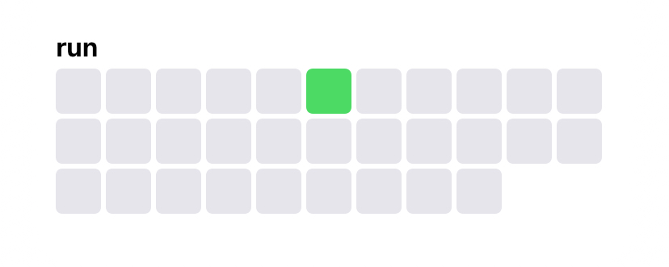
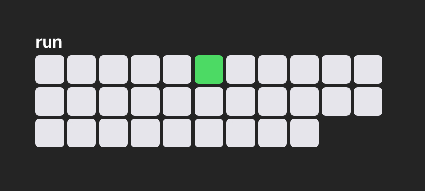

## Minimalist Habit & Countdown Widgets for Scriptable

Two lightweight iOS widgets built with Scriptable:

1. **Habit Tracker** – Track a single daily habit with a 3×N grid.  
2. **Countdown Tracker** – Show a “D-X” countdown and progress grid toward a target date.  

Both scripts run as Medium-sized home-screen widgets.

---

### Requirements

- **iOS 14 or later**  
- **Scriptable** app installed  
- A **Medium-sized Scriptable widget** slot on your home screen  

---

### Installation

1. **Open Scriptable** on your iPhone/iPad.  
2. **Create a new script** (give it a clear name, e.g. `HabitTracker.js` or `CountdownTracker.js`).  
3. **Copy & paste** the corresponding code (from this repo) into that new script and **Save**.  
4. On your home screen, **add a Scriptable widget** of size **Medium**, then select the script you just created.  

Once installed, run each script one time **inside Scriptable** to configure it. After that, the home-screen widget updates automatically each day.

---

## 1. Habit Tracker

#### Overview

- **First run** (inside Scriptable) prompts you to choose:
  - **Theme** (🕶️ Dark or 💡 Light)  
  - **Habit name** (e.g., “Meditate”)  
- Stores your check-in dates securely in Keychain under `habitTrackerTheme`, `habitTrackerName`, and `singleHabitTrackerDates`.  
- Renders a 3×N grid representing the **current month** on the widget:
  - 🟩 Green squares = days you checked in  
  - ⬜ Gray squares = days you didn’t check in or days outside the month  

From then on:

- **Tap the script inside Scriptable** to open a menu:
  - **☑️ Check-in** toggles today’s entry (adds/removes today’s date).  
  - **⚙️ Settings** lets you:
    - Change theme  
    - Change habit name  
    - Reset all data (clears every saved date)  
- The home-screen widget displays your habit name + the updated monthly grid automatically.

---

### Screenshots

  
Light theme displaying the habit grid.

  
Dark theme displaying the habit grid.

---

## 2. Countdown Tracker

#### Overview

- **First run** (inside Scriptable) prompts you to enter:
  - **Theme** (🕶️ Dark or 💡 Light)  
  - **Widget title** (e.g., “Trip to Japan”)  
  - **Target date** in `YYYY-MM-DD` format (e.g., `2025-12-31`)  
- Records your **install date** (today) in Keychain under `countdownInstallDate`.  
- Calculates:
  - **totalDays** = days from install date to target date (inclusive)  
  - **elapsed** = days since install (today − install date)  
  - **remaining** = totalDays − elapsed  
- Displays on the widget:
  1. Your custom **title** (e.g., “Trip to Japan”)  
  2. A **“D-X”** label where **X** = days remaining (counting today as day 0)  
  3. A 3×N grid:
     - 🟧 Orange squares = days already elapsed  
     - ⬜ Gray squares = days left until target  

After configuration, the home-screen widget automatically refreshes the countdown daily.

#### Re-configuring

To change title or target date later:

1. In Scriptable, go to **Settings → Keychain**.  
2. Delete these four keys:
   - `countdownTheme`  
   - `countdownTitle`  
   - `countdownTargetDate`  
   - `countdownInstallDate`  
3. Next time you run the script inside Scriptable, you’ll be prompted again for theme, title, and date.

---

## Customization

- Both scripts store settings in Keychain under unique keys.  
- Edit the `CONFIG` object at the top of each script to adjust:
  - `padding`, `spacing`, `cornerRadius`, and number of `rows`  
  - The widget’s total width (`widgetWidth`) if your device differs  
- To change the “checked”/“elapsed” and “unchecked”/“remaining” colors, modify the hex codes in the `createWidget(...)` function of each script.

---

## License

Released under the **MIT License**. See `LICENSE` for details.
